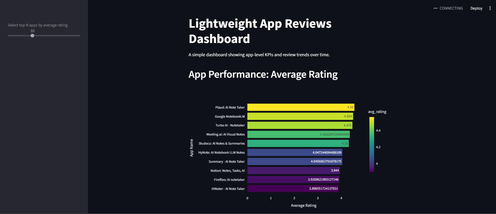
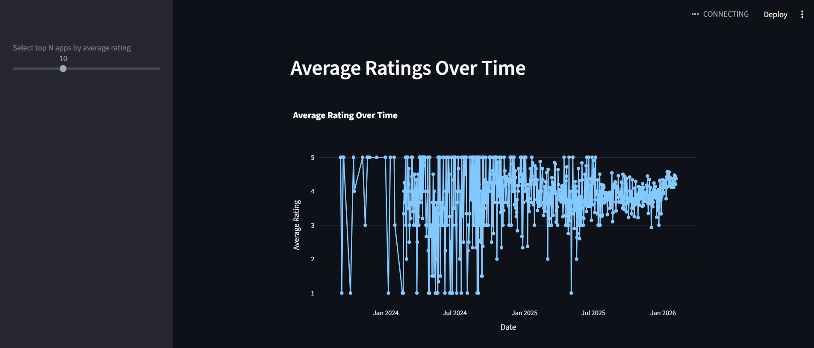
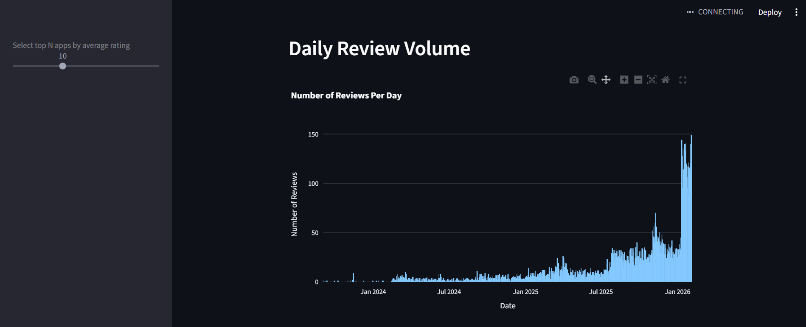

Feedback:

- Think about writing with append in the loop; it is always better to prevent data loss if code crashes
- The data quality verification is neat!
- Please add a screenshot of your dashboard to the readmefile

# Dashboard screenshots : 

# Observations on supporting the new batch :

1. How many changes were required? 
-> Two additions: format detection (CSV vs JSONL) and a deduplication step. The rest of the pipeline was unchanged.

2. Is it a full refresh or implicit? 
-> It's a full refresh; the old processed file is deleted and rewritten from scratch each run.

3. How are duplicates handled? 
-> r_2002 appears twice? the script now explicitly drops duplicates keeping the first occurrence and logs how many were found.

4. What happens to unknown apps? 
-> com.ghost.notes and com.newnote.ai are not in the apps catalog, they are kept in the reviews but app_name will be None, and a warning is printed.

# Observations on schema drift :

1. Which parts of your pipeline rely on hard-coded column names?
-> transform_apps_reviews.py relied on "app_name", "app_id" by name in the CSV branch. serve_layer_metrics.py references "reviewId", "score", "app_id", "app_name", "at" in its groupby and agg calls. verify_data_quality.py explicitly references "score", "thumbsUpCount", "at" in its numeric summary and anomaly checks.

2. Does the pipeline fail explicitly, or does it produce incorrect results silently?
-> Mostly silently. pandas does not raise an error when expected column names are absent, it simply produces NaN for any operation referencing those columns. score and at being NaN would have propagated into serve_layer_metrics.py, producing NaN average ratings and broken daily aggregations with no exception raised. The only explicit crash would have been in verify_data_quality.py which references column names directly.

3. How localized or widespread are the required code changes?
-> The fix was fully localized to transform_apps_reviews.py. Because normalization happens at load time, all downstream scripts (serve_layer_metrics, verify_data_quality, dashboard) required zero changes, they continue to operate on the standard column names. This confirms that the transformation layer is the correct place to absorb schema changes.